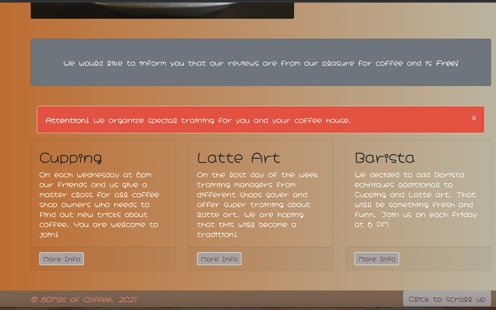
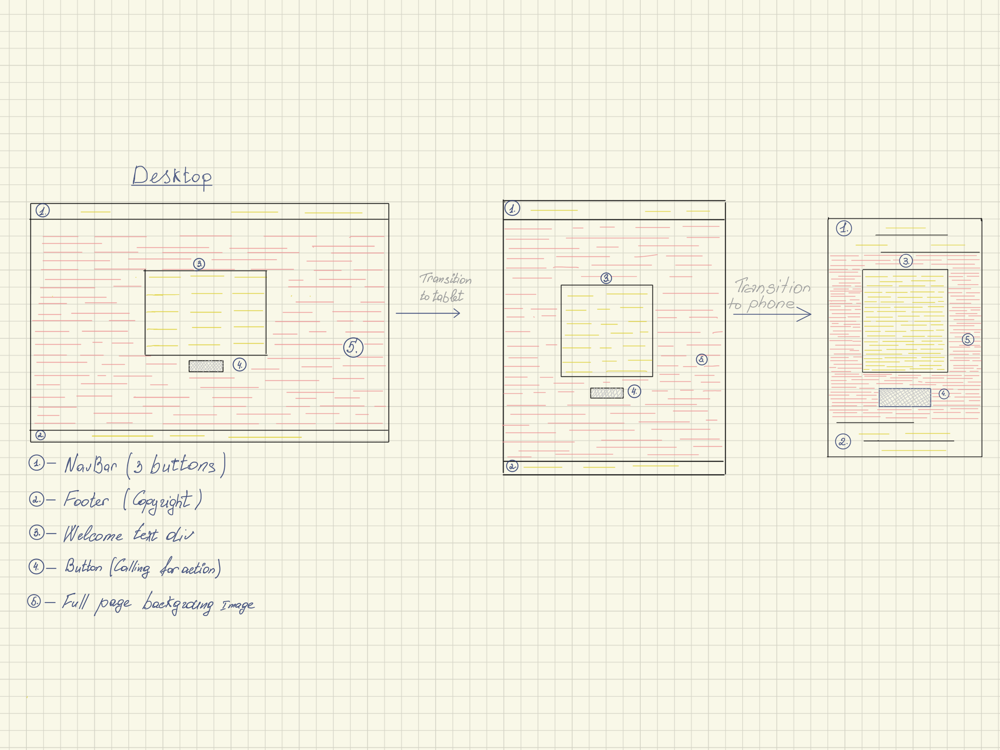
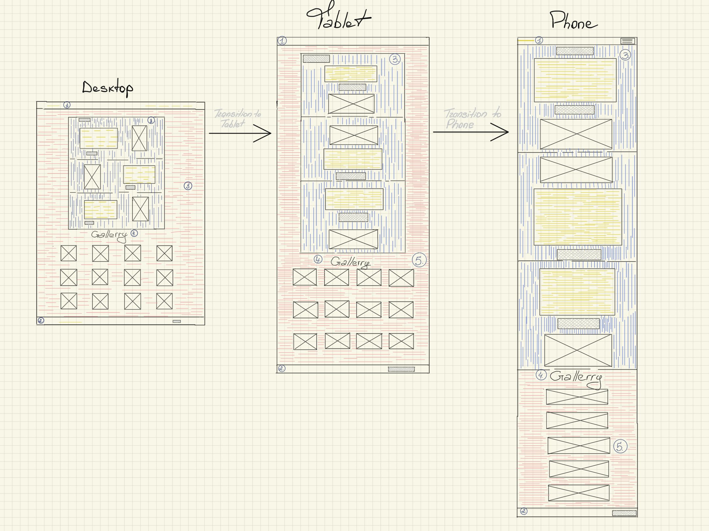
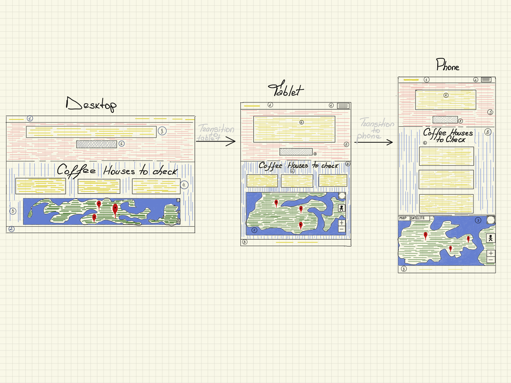
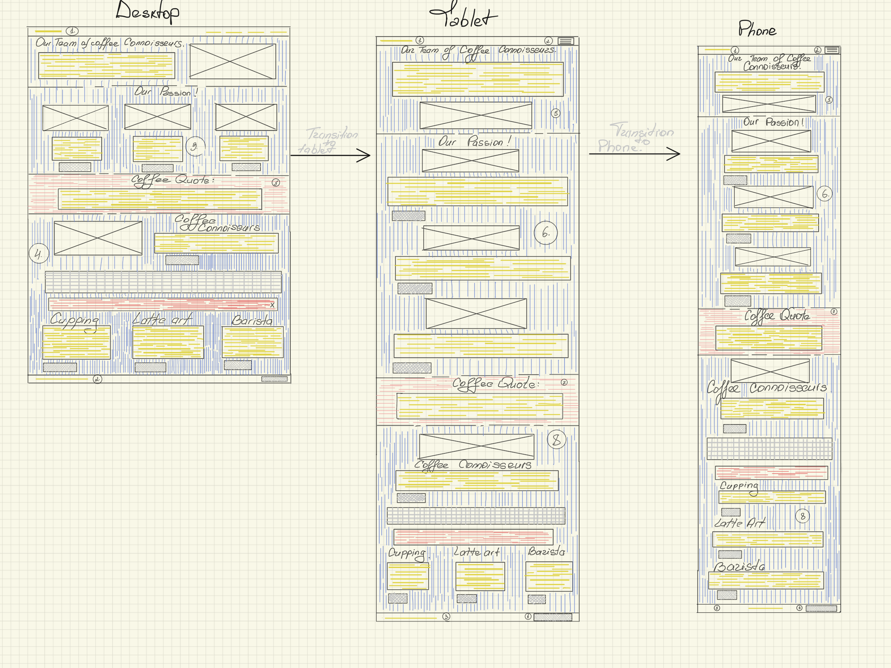
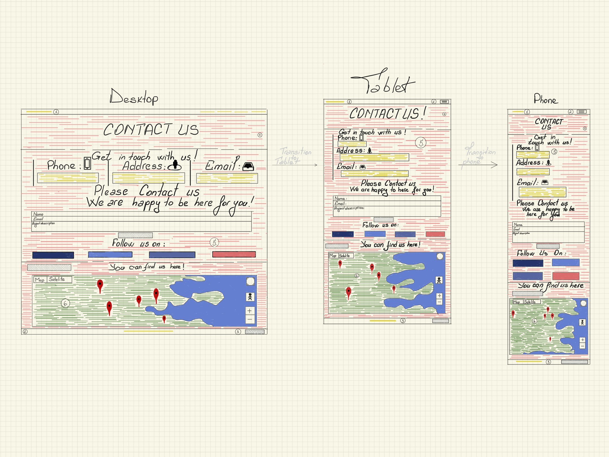
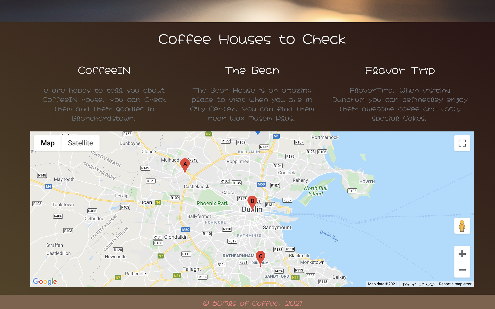
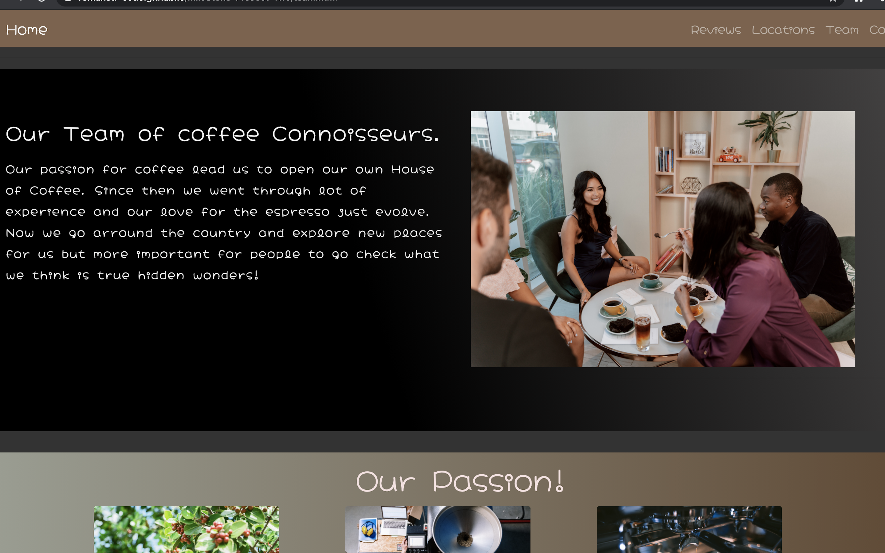

<h1 align="center">Welcome To Second Milestone Project</h1>

[Live Milestone Project 2](https://romanstr-code.github.io/MileStone-ProJect-Two/)

<h2 align="center">Code Institute / Interactive Frontend Development. Second Milestone Project</h2>

<h2 align="center">Coffee Houses Reviews</h2>

Code Institute gives you a variety of ideas from where to pick and start your projects. In the Second Milestone Project I went with an idea what I have in mind 
for some time and that is: Coffee Houses Reviews. Because I am a coffe lover and always want to try new coffee shops and the techniques that changes from place to place.
So I would truly like if there would be a website that would be owned by profesionals baristas who just walk arround the city or arround the country
looking for amazing hidden places that deffinetly would worth visiting by people like me.
From this simple idea I started to build the site. At first, for first page, was thinking of simple first page, a background image on all screen. Want to keep the buttons on minimal and to point
just on the pages which the user need  to pay attention the most. The main text, it ment to be on the middle of the page and describe short what the website is about
plus a button to call for user attention to click.  

<strong>Reviews</strong>  
On the first page on accessing the website, I was thinking it would be informative to have displayed three Coffee shops, that Baristas already reviewed and encourage to visit.
As well, the page should display the places that was spoke off when enter the page. For doing that I opted for a modal-gallery, and to make it as Interactive as possible for user buy adding some <em>JS</em> for modal gallery that visitors can click or 
on tablets and mobile buy touch to pop and see the image and where was done. Also, would be great if site visitors could access the gallery stright, so I added a button with <em>JS</em> help to take them to gallery and back to top for reading the Reviews.
On all website I decided to go with a simple footer, to display just copyright and button back to top. 
To take the transition slowly and directly to next page added buttons to each review, to point to their locations if visitors would find them interesting and would like to visit them.
 

<strong>Locations</strong> 
Arriving on Locations page. I wanted for user to feel Welcomed and find the piece of information quick and as simple as possible. For doing that, I opted for a simple page with information just related to the reviews page from where user will travel.
So You will find a division with a background image, should display something related or to point to a map or direction. On top of that short text to display a direct message to traveler and a modal body with some curiosity about the people who deal with cofee deeply.
Then went with a division with a map and those three shops that the review is about. The map I decided to do just with three markers and to point in three directions, where the places are. Above the map, should be displayed addresses for all 3 shops.
A obvious choice from here on is to go check who are the people behind this reviews. In an clear step, you find easy, on the navigation bar <em>Team</em>, so you access it to check them out. 

<strong>Team</strong> 
The idea of this page is, to emphasize the  profesionality and level of knowledge of the website owners and love for double shots of espressos.
So decided to go with couple of divisions to include all above in a nice and slow pace.
So first division is about the Team, small text of what they do and their image displayed. Going to next division you can find thier love and affection for what they do and from where and how a proper cup of coffee it's done.
And for better and more information went with buttons to redirect to [Wikipedia](https://www.wikipedia.org/) for more detailed information.
Traveling down the page you can find a quote division, with a nice quote on top of a nice background image.
Scrolling further down the page you encounter the last division. Now this division should make an impact on the future colaborations with other coffee lovers, coffee shop owners and point to contact this amazing team.
So your eye slightly see the image of a coffee cup and short team text with a button that call you to contact the team.
As well in this division they inform and alert about their activity and trainings that they provide. Added a small pices of <em>JS</em> alert to point to trinings and separated them in three cards.
Each card should have buttons to point again for more information and to take website traveler to it. Now, for thouse who decided they need to make contact with the team easy can navigate on the navigation bar to section Contact or by clicking on the last division button contact us. 

<strong>Contact</strong> 
On Contact Us page, the idea behind was simple, but with a small touch. My Thoughts about contact page was to have a division with a background image and a plain white text that would say : CONTACT US.
By Scrolling down you first would encounter a division that should ask to get in touch with team and be separated by 3 columns and on each column to be separated by 3 vertical lines and on mobile to form one.
Each column to represent different ways to be contacted and reached. And also added the contact form in this division for potential colaborations and Interactivity with the website travelers.
Under the Contact Us form , included a section with couple of social links to be displayed for the users to follow the team on them.
Then I liked the idea of adding a google map with a custom button that point out to new coffee places to check. By clicking the button on the map should be displayed couple of markers and appear on the map in a consecutive order, not all at once. 

Wanted to mention that on this project I decided to go with a minimalistic footer and minimal content on all pages footer.
In conclusion, the site is build for a group of coffee lovers, or coffee house owners with big experience that they have in industry and wich they want to share with people and to entertain them with fantastic places to visit.
The site is easy to navigate, from first page when accessing you can clearly understand the steps you should take for easy site travel. 
Each page is displayed on the navigation bar and is easy to access and is intuitive for all kind of travelers. If you are here to find new places you can easy find them if you are here to 
ask for colaboration with the team is as well easy to access their service.
Each page is different and uniq in their own ways and all of them indicate into very exact and specific direction for all users to find it easy to understand.

# User Experience (UX)

### First Time User Goals

#### As a potential traveler

1. I need to know what website represent.
2. I need to have an easy understanding on how to travel inside the site.
3. I need to understand the purpose of the website.
4. I want to know if it would be possible to reach them.
5. I want to know who this group are.
<h1 align="center"></h1>

### Returning Visitor Goals

#### As a returning traveler

1. I want to know what else they do.
2. I want to know what they review.
3. I want to know locations of what they review.
4. I want to know if the place has, how to contact them.
5. I want to know if there are special trainings.
6. I want to check their reviewed places.
<h1 align="center"></h1>

# Design

 #### Colour Scheme
 - The Project have different colors form page to page.
 - On Home Page mostly dominant is color white for text, black for buttons with ease-in-out background color red.
 - Review Page has mostly white/pink.
 - Locations Page uses linear-gradient colors combination between green/blak/red.
 - Team page uses combination of linear-gradient colors of (white/black / silver / lightBrown to light/silver and to orange/green.)
 - Contact page uses white colors.

 ### Typography

 - The website uses Hachi Maru Pop for main Typography. As fallback site uses sans-serif Typography.
 - Hachi Maru Pop - Perfect fit for a Coffee house review website.

 ### Imagery
 - All website contain images.
 - Every page has their carefuly picked images.
 - Each page images are meant to attract traveler eye as much as possible.
 - All images are placed accordingly.
 - By navigating the website they translate different emotions to users.

##  Wireframes
[Wireframes Folder](https://github.com/romanstr-code/MileStone-ProJect-Two/tree/master/wireframes)
 <h2 align="center">Projects Wireframes </h2>
 <h3 align="center">HOME PAGE</h3>
 <h1 align="center"></h1>
 <h3 align="center">REVIEWS PAGE</h3>
 <h1 align="center"></h1>
 <h3 align="center">LOCATIONS PAGE</h3>
 <h1 align="center"></h1>
 <h3 align="center">TEAM PAGE</h3>
 <h1 align="center"></h1>
 <h3 align="center">CONTACT PAGE</h3>
 <h1 align="center"></h1>

 ## Features 
 The website visitors should have positive and nice feeling when browsing through.
 - From first to last page you can find a responsive NavBar with buttons and hints to Guide you.
 - On all pages you will encounter nice displayed information.
 - Website has a fully Interactive Gallery with nice images and short clear description.
 - Easy way of finding the locations of reviewed places by accessing locations page.
 - For more information about people who offer you the reviews you just need to go to Team page.
 - To contact the amazing group you just need to go to Contact page.
 - Well displayed contact information, contact form 
 - For newly reviewed places you can find on contact page and access their locations by clicking on the map button.

 ### Home Page
- The landing on <strong>Home Page</strong>  
It is meant to make you feel Welcomed and chill. First what you will observe will be full page background image with a reduced opacity and a <strong>Hello</strong> vibe.
On the top, Page has 3 buttons that clearly indicate to 3 things:

1. <em>Reviews</em>  
- Take action and check the reviews out.
2. <em>Team</em> 
- Find out who or what the Team is offer.
3. <em>Contact</em> 
- You can contact the Team first, if you already are familiar with their work. 
In the middle of the Page you find a nice Welcome message that it meant just for you alone and a nicely placed button under the paragraph that calls you for action.
And finaly you can see a minimalistic Footer with a simple copyright, and all is to make the user feel welcomed and not overloaded with information from first encounter with the website.

### Reviews Page
- <strong>Reviews Page</strong> 
On arriving to Reviews Page you encounter a nice vibe from start. 
You can see clearly new navigation bar with all pages displayed.  
- <strong>Home</strong>  placed on the left side on the bar.
#### The rest of the website pages you find on the right:
1. <strong>Reviews</strong>
2. <strong>Locations</strong>
3. <strong>Team</strong>
4. <strong>Contact</strong>
 
 Going down we encounter the page content, image and buttons. Each of this is meant to entertain, to make you be intrested and curious to find out more.
 On the left hand side you see a button that is asking for your attention. By clicking it, it will take you to the Gallery section of the page.
 And on the opposite you can find a nice button on the footer to take you back from were you came.
 Scrollingdown the page you will encounter a division wich will display content and each content will have a image for displaying what content is trying to tell.
 Each of the content has a button that calls for specific action and that action is to transition to next page.
 On the end of the page you will find a nice and Interactive Gallery.
 On all devices you will interact with information, buttons and Gallery.
 On tablet nothing should change , the bigger change should happen on mobile devices.
 On mobible devices you will see the Home on the Left and a Hamburger icon on the right.
 When clicking the Icon the Menu drops down.
 Footer on the page is minimalistic and diplays just copyright and back to top button.

 ### Locations Page
 - <strong>Locations Page</strong> 
 On this page the navigation bar and footer is displayed in the same way as on <em>Reviews Page.</em> 
 The <em>Locations Page</em> is the extension of <em>Reviews Page</em>.
 Going inside this page, you will encounter a division with a warm background image, easy content and a modal button that asks for your attention.
 Next on the page is a simple but informative division with a google map, and 3 shops that was reviewed on Reviews Page and how to find them arround.
 Very simplistic page but with very straightforward intent.

 ### Team Page 
 - <strong>Team Page</strong> 
 This page is well constructed and from top to bottom each division has their own way to interact and offer feedback to the site traveler.
 From descktop to tablets and mobile devices this page gives a very clean and beautiful way of feeling the job that the team does.
 On the top of the page you find first division with a image on the right and text on the left. This division explain who the team are and what they love to do.
 Going down the page you find Passion division. In this one,the content and images is placed for you to understand from where coffee comes, and what long road is making till arriving in your cup.
 Each of this steps has their own button to take you to read or document yourself more about this particular subject.
 On middle of the page you encounter a Quote division with a background image and quote on the display.This is made to ease and chill visitors attention.
 The last division is where the all previous try to lead.
 In this last part of the page user build interest finalising with a well two structured target from the website owners: 
 - 1. You contact them for colaborations
 - 2. You find out what else beside reviews they are doing. (You find this out by noticing the danger alert that is displayed right on top of the information about their special trainings)

 Page has good sub intent for user to be intrested to access the Contact page.

 ### Contact Page
<strong>Contact Page</strong>
 Contact page, is important for both, users and owners.
 The page top greet you with a simple division, background image and just a simple greeting and same time calling for accessing the contacting information.
 On Scrolling down, you transition to a part of the page with 3 columns with information like the address, phone and email of the team who owns the site.
 Traveling slightly down the page, you encounter a Contact Us form, so if you interest in some particular service you need or want, you easy can take action and contact us.
 Slightly under Contact us Form you find another small division with social links and what calls you for Follow.
 The Contact Page as well is equiped at the end of the page with a google map. 
 The map displays recent coffee places that was reviewed and make a call out to look for them by accessing the Check for button.
 By accessing the button the locations of newly reviewed shops will appear on the map in a consecutive order and will Bounce.
  
  ### Tablet Screens
  - On tablets screens, not much changes that you can experience on the Desktop. Still it Offers a uniq way of living the experience of travel inside the site.
  - Gallery, buttons, Maps, Contact form, Navigation Bar , Social links all of them have a smooth user experience and is helping visitors to find easy what they looking for.

 ### Mobile Decices
 - <strong>NavBar</strong> 
 Navigation bar on mobile devices is simple and clear for all who may access the website.
 On the right is situated <em>Home</em> and on the right is Hamburger Icon.
 When accessing the icon, it drops and displays the all pages on the left hand side right under Home page, which makes it easy to predict that each page follows the other in the correct order.
 - <strong>Divisions</strong> 
 Each division , from page to page differ but the main goal and eyecatching is present.
 All are displayed and shows the content in a nice and well balanced way.
 - <strong>The Content</strong>  
 All Content is displayed in the easy way for client, user, present and future visitors to be able to understand their position in the website "map" and what is this piece of text about.
 - <strong>Buttons</strong>  
 All buttons have a very clear visibility and are intuitive and easy to understand their callouts.
 - <strong>Google map</strong>  
 - Is displayed in a visible way and you can easy interact and locate the positions what is shown on the map.
 - In Contact Page map is easy to interact with maps button to locate new places with the help of droping markers on the map.
 - <strong>Contact Form</strong> 
 - Contact form takes a visible though small position on the page.
 - User easy understand it and easy type and interact with it.
 - <strong>Images</strong>
 - Images takes an Perfect amount of space and offer a good Scrolling and navigating experience.

 # Technologies Used

-  ## Languages Used
- [HTML5](https://developer.mozilla.org/en-US/docs/Web/Guide/HTML/HTML5)  
- [CSS](https://developer.mozilla.org/en-US/docs/Web/CSS) 
- * <strong>JavaScript</strong> 
 - * Was used in the project to offer visitors more interactivity and smooth website feeling.
- [JavaScript](https://developer.mozilla.org/en-US/docs/Web/JavaScript) 

## Frameworks, Libraries & Programs Used

- [Bootstrap 4.0.0:](https://getbootstrap.com/) 
  i.Use Bootstrap to simplify the structure of the website and make the website responsive.
- [jQuery](https://jquery.com/) 
  i.jQuery came with Bootstrap to make the navbar responsive. 
  As well as added jquery script for page Interactivity.
- [EmailJs](https://www.emailjs.com/)  EmailJs was used for contact us form for more Interactivity with user.
- [GoogleFonts](https://fonts.google.com/) 
  i.The project uses google fonts to style website fonts.
- [Google Maps](https://developers.google.com/maps/documentation/javascript/examples/marker-simple) Google maps was used for user Interactivity and for pointing for specific location.
- [Font Awesome](https://fontawesome.com/) 
  i.The project uses fontawesome for adding icons and design purpose.
- [Git](https://git-scm.com/) 
  i.The Project used Git  for version control by utilizing the Gitpod terminal to commit to Git and Push to GitHub.
- [GitHub:](https://github.com/) 
  i.ThIs project use GitHub, for the purpose of storing the code after this one was pushed from Git.
- [Ideate](https://apps.apple.com/us/app/ideate-design-wireframe-ux/id1494036474) 
  i.The project uses an Apple app called Ideate for creating Wireframes .

## Testing
- For testing were used Css Validation Service and Markup Validation Service.Reason is to  check the validity of the website code.

 - [CSS Validation Service](https://jigsaw.w3.org/css-validator/#validate_by_uri) 
 - [Markup Validation Service](https://validator.w3.org/)

 ## For JavaScript
 - Used JSHint for correctness of JS code.

 - [JSHint](https://jshint.com)

## Results of Testing
- [TESTING FOLDER](https://github.com/romanstr-code/MileStone-ProJect-Two/tree/master/testing) 
- * Each Page Individual.
- [Home](https://github.com/romanstr-code/MileStone-ProJect-Two/blob/master/testing/index.png)
- [Reviews](https://github.com/romanstr-code/MileStone-ProJect-Two/blob/master/testing/reviews.png)
- [Locations](https://github.com/romanstr-code/MileStone-ProJect-Two/blob/master/testing/locations.png)
- [Team](https://github.com/romanstr-code/MileStone-ProJect-Two/blob/master/testing/team.png)
- [Contact](https://github.com/romanstr-code/MileStone-ProJect-Two/blob/master/testing/contact.png)

# Testing User Stories from User Experience (UX) Section

- ### First Time Visitor Goal
1. 
- * Being for the first time on the website I need to understand the purpose of the site.
- * When arrived on the site I will notice the simplistic aproch but at the same time very warm for eye perception.
- * Second step would be to notice the callout button that invites me to  "Come In ".
- * Third step, would be the nice transition to what will be a pages of reviews and the reviews themselves plus a gallery that relate directly to the reviews.
2. 
- * As well as first time visitor I would like to know more about where are this reviewed places.
- * Simple, by click a button called back to top, it takes you back on the navigation bar, and then it displayed the Locations page.
- * By visiting the locations page, it will give me all I need to find out more about the places that I wanted to know in previous page.
<h1 align="center"></h1>

- ### Returning Visitor Goals
3. 
- * As a potential quest, I need to know who does this reviews.
- * For Finding out this information I just need to acces the Team page.
- * In manner to find out what I need I just start by exploring the page.
4. 
- * In the quality of potential visitor, I want to know more about what else the team promote and does.
- * So for sure I will find the alert division and the callout from it.
- * By going towards the alert , I will find what else team does.
<h1 align="center"></h1>

- ### Frequent User Goals
5. 
- * In quality of a convienced visitor, I would like to know more about when and where the new reviews may appear.
- * So by simple click, I will travel to Contact page.
- * There I will find a nice greating page, whith a simple callout message "Contact Us".
- * Aslo, I will find a well placed Contact Us form to ask my questions.
- * There as well, I will find out about newly made reviews and how to locate them on the map buy using the map button.
- * As well as if I want quick review of the Team, I can as well access social links.
<h1 align="center"></h1>

# Further Testing

 1. The Project was Tested in several Web Browsers like :
- * a. [Google Chrome](https://www.google.com/chrome/)
- * b. [Microsoft Edge](https://www.microsoft.com/en-us/edge)
- * c. [Safari Browsers](https://www.apple.com/safari/)
- * d. [Mozilla Firefox](https://en.wikipedia.org/wiki/Firefox)
2. Viewed On Number of devices
- a. Xiomi
- b. Iphone 11
- c. Iphone 12 max
- d. Iphone X
- e. Iphone X Max
- f. Galaxy S10
- * As well as on smaller devices from Google Chrome developer tools.
3. Viewed on Tablet
4. Viewed on Laptops

#### Call A friend for help
- For help towards the finish line I sent my project to :
- * Friends
- * Work colleagues
- * Sister 
- * Cousins 
All this to help me point out the errors and mistakes I omitted.
- Final checking
- * NavBar Links to be correct
- * Buttons to take to correct destination
- * Gallery modal to work proper
- * Google Map Droping markers to proper displayed
- * Contact Form to execute a massage 
- * On smaller devices Hamburger Icon to be displayed and work correct.

## Known Bugs

### On Tablet
- * On some Tablets on the contact page the social links dont appear in the same line 
- * As well the social links sticks out from their background color.
- * Some text a bit hard to read

### On Small devices
- On some devices the page content is hard to read.
- Social links on hoovered makes not a smooth encounter.
#### On Desktop
- On some Browsers some images is displayed on all screen which makes it not nice to website feedback feeling.

## Deployment

### GitHub Pages

#### This Project was developed with [Gitpod](https://www.gitpod.io/) and was Pushed to [GitHub](https://github.com).
- 1. Open <strong>GitHub</strong> site.
- 2. Log In into Your account
- 3. Navigate to your Repository
- 4. Pick Project Repository
- 5. On the right side , click on Settings
- 6. Scroll to GitHub Pages
- 7. Click the <em>None</em> or <em>Branch</em> drop-down menu and select a publishing source.
- 8. Use the drop-down menu to select a folder for your publishing source.
- 9. Click Save 

### Forking the GitHub Repository
- * With forking we can produce a personal copy of someone else's project.So We can make changes to the project without affecting the original Project.
- 1. Log In to GitHub
- 2. Locate the Repository 
- 3. On top right side click On Fork button.
- 4. Now You have a copy of Repository

### Making a Local Clone
- 1. Navigate to GitHub main page Repository.
- 2. Find Green Code button and click it.
- 3. To clone the repository using HTTPS you need to pic "Clone with HTTPS".
- 4. Open the terminal
- 5. Change your current working directory to a location you want cloned directory.
- 6. Type <strong>git clone</strong> and then paste the URL you copied on step Nr3
- 7. Press enter to create your local clone.

# Credits

### Code

- On the Reviews page Gallery ,JS code was inspired from  [W3schools](https://www.w3schools.com/bootstrap/bootstrap_carousel.asp)
- Contact Us Form came from Code Institute project made with teacher [Interactive Resume](https://github.com/romanstr-code/InteractiveFrontendDevelopment-Resume)
- The Google map for last page footer I imported from [Interactive Resume](https://github.com/romanstr-code/InteractiveFrontendDevelopment-Resume)
- The Google map with drop down markers took from [Google developers](https://developers.google.com/maps/documentation/javascript/markers)
- [Bootstrap4](https://getbootstrap.com/docs/4.0/getting-started/download/) was used for the entire project, in purpose of responsives and grid sistem.

### Content
- Foto used in the project were used from a free stock videos and foto site [Pexels](https://www.pexels.com/)
- Links for couple of division will point to [Wikipedia](https://en.wikipedia.org/wiki/Main_Page)
- The text Content was written by me. 

### Acknowledgements

#### My Mentor
- I want to thank my mentor on this particular project. For me JavaScript is taking a time to ajust in my head line of code.
So when I made the call with Gerry, he point out at my week spots from JavaScript scripts and gave me hint on what dirrection should point my attention on.
Plus gave me a number of advices on top and something else to add to project.

#### Code Institute

- Code Institute for amazing customer support and for hard work the staff doing for us students, to have a nice, smooth and interesting navigation through all course. 